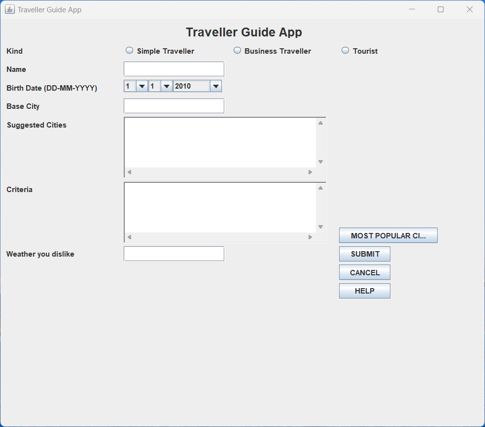
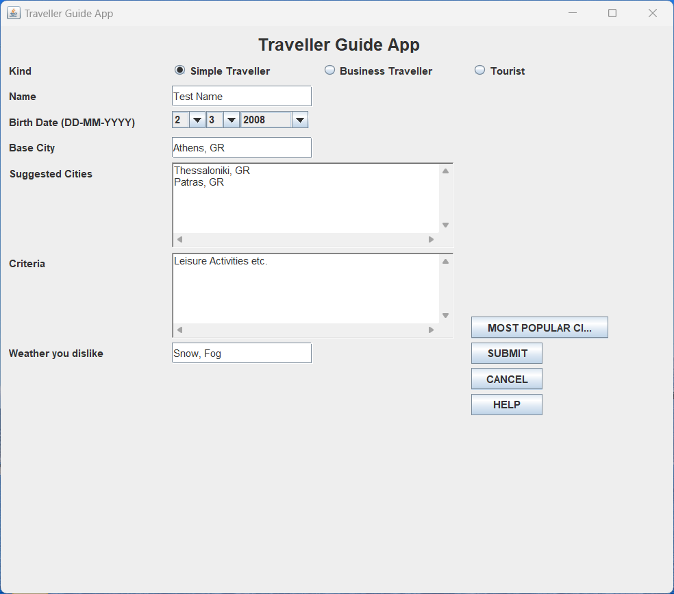
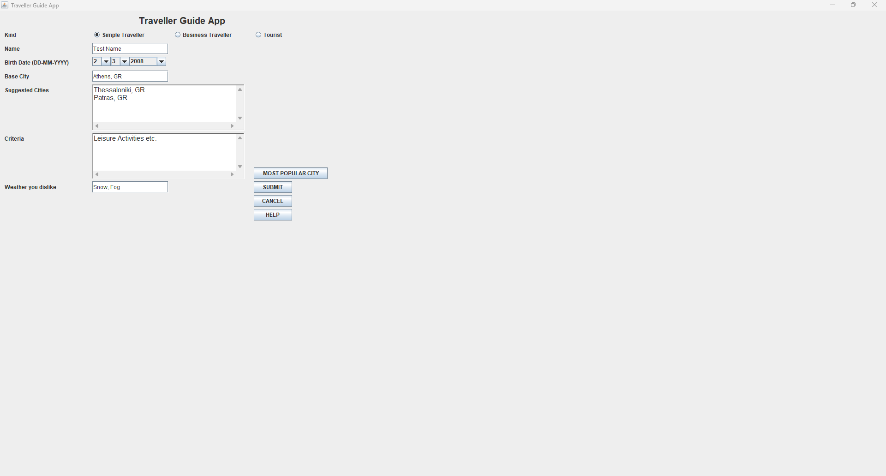
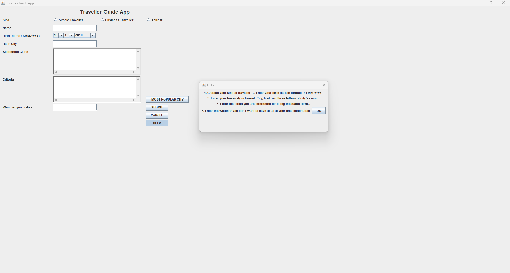
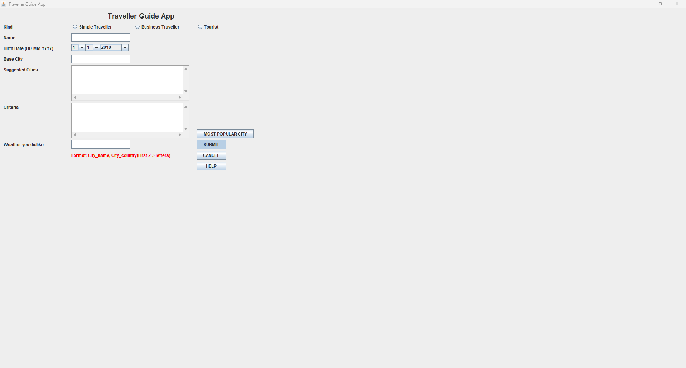
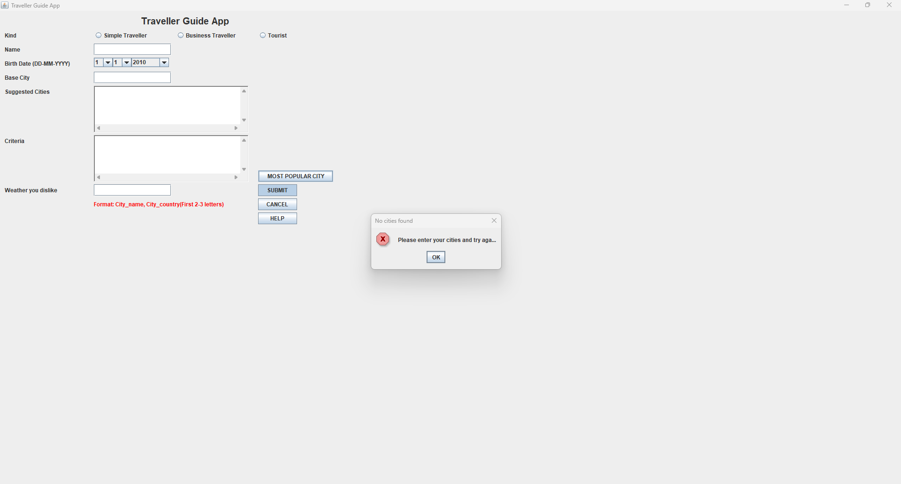

# traveller-guide-app
A Java application that provides city recommendations based on traveller preferences.  
All file paths and backend configurations are now **configurable via `application.properties`**.

## Configuration

Edit `src/main/resources/application.properties`:

```properties
# application.properties
storage.backend=file
# base folder (for multi-file mode)
storage.basePath=.
storage.travellersFile=data/travellers.json
storage.popularCitiesFile=data/popular_cities.json
storage.helpFile=docs/help.txt
```

## Build and Run Instructions

This project is a Java desktop application. It can be built and run with **Maven**, and you can still use **IntelliJ IDEA**.

---

### 💡 IntelliJ IDEA

1. Open IntelliJ IDEA and choose **Open Project**, selecting the `traveller-guide-app` folder.
2. Mark `src/main/java` as **Sources Root** if not already marked (Right-click → `Mark Directory as → Sources Root`).
3. Maven dependencies will be automatically detected.
4. Create a Run Configuration with `com.bellias.travellerguide.TravellerGuide` as **Main class** (replace with your actual main class if different).
5. Run the application.

---

### 💻 Command Line (Windows / Linux / WSL)
Requirements: JDK installed and `JAVA_HOME` set.

1. Open a terminal in the project root.
2. Build the project with Maven:
   ```bash
   mvn clean package
   mvn exec:java -Dexec.mainClass="com.bellias.travellerguide.TravellerGuide"
   ```

---

## 📸 Application Screenshots

Here are some screenshots of the Traveller Guide App in action:

| Initial View                                           | Initial View (Filled)                                                | Large View (Filled)                                              |
|--------------------------------------------------------|----------------------------------------------------------------------|------------------------------------------------------------------|
|  |  |  |

| Help Window                                          | Error Message                                           | Error Modal Popup                                                |
|------------------------------------------------------|---------------------------------------------------------|------------------------------------------------------------------|
|  |  |  |

## Generating SBOMs (Software Bill of Materials)

We use [Syft](https://github.com/anchore/syft) to generate SBOMs for the project dependencies.

### **Manual Generation (Local)**

1. Install Syft:
```bash
# Linux / macOS
curl -sSfL https://raw.githubusercontent.com/anchore/syft/main/install.sh | sh -s -- -b /usr/local/bin

# Windows (Scoop)
scoop install syft
```

2. Navigate to project root:
```bash
cd /path/to/project
```

3. Run the SBOM generation script:
```bash
./generate-sbom.sh
```

This will create/update the sbom/ directory with:
- sbom.json (CycloneDX format)
- sbom.spdx.json (SPDX format)
and commit the changes automatically.

4. Inspect the SBOM (optional):
```bash
cat sbom/sbom.json | jq '.'
```

---

### Automated GitHub Actions Workflows

We use GitHub Actions for automation. These are the key workflows:

#### ✅ Build and Test
- Runs Maven build and tests on every push and pull request.

#### 🔐 Security Scan (Snyk)
- Requires you to set the repository secret `SNYK_TOKEN`.
- Scans dependencies for vulnerabilities with `snyk test --all-projects`.
- By default fails only for **High** or **Critical** issues.
- Results are uploaded to the GitHub Security tab (via SARIF).

#### 🧾 Generate SBOM
- Runs on pushes to `main`, `development`, and related task branches or can be triggered manually.
- Generates both CycloneDX and SPDX SBOMs.
- Commits the SBOMs back to the repository automatically.

You can trigger these from the **Actions** tab in GitHub or via pushes/PRs.

---

## Notes
- All file paths are relative to the project root by default.
- To override, change values in application.properties.
- Supports both file and in-memory backends for testing.

